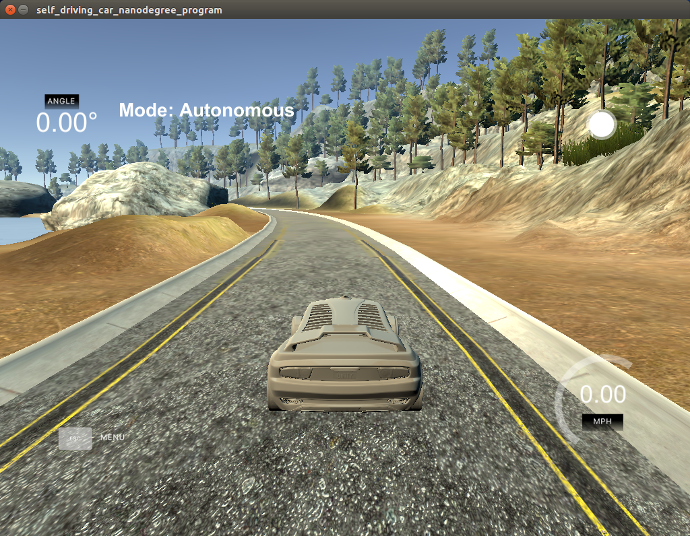

# CarND-Controls-PID
Self-Driving Car Engineer Nanodegree Program

---

## Dependencies

* cmake >= 3.5
 * All OSes: [click here for installation instructions](https://cmake.org/install/)
* make >= 4.1
  * Linux: make is installed by default on most Linux distros
  * Mac: [install Xcode command line tools to get make](https://developer.apple.com/xcode/features/)
  * Windows: [Click here for installation instructions](http://gnuwin32.sourceforge.net/packages/make.htm)
* gcc/g++ >= 5.4
  * Linux: gcc / g++ is installed by default on most Linux distros
  * Mac: same deal as make - [install Xcode command line tools]((https://developer.apple.com/xcode/features/)
  * Windows: recommend using [MinGW](http://www.mingw.org/)
* [uWebSockets](https://github.com/uWebSockets/uWebSockets)
  * Run either `./install-mac.sh` or `./install-ubuntu.sh`.
  * If you install from source, checkout to commit `e94b6e1`, i.e.
    ```
    git clone https://github.com/uWebSockets/uWebSockets 
    cd uWebSockets
    git checkout e94b6e1
    ```
    Some function signatures have changed in v0.14.x. See [this PR](https://github.com/udacity/CarND-MPC-Project/pull/3) for more details.
* Simulator. You can download these from the [project intro page](https://github.com/udacity/self-driving-car-sim/releases) in the classroom.

There's an experimental patch for windows in this [PR](https://github.com/udacity/CarND-PID-Control-Project/pull/3)

## Basic Build Instructions

1. Clone this repo.
2. Make a build directory: `mkdir build && cd build`
3. Compile: `cmake .. && make`
4. Run it: `./pid`. 

## PID Hyperparameters

#### P - Proportional Control
The proportional control gives a control feedback proportional to the Cross Track Error (cte). Using a proportional control, the steering angle value is given as folliwng: <br>
steering angle = -Kp * cte, where Kp (>0) = Propotional gain <br>
A proportional control, when used by itself, is unstable and has an effect of overshooting the target trajectory. 

#### D - Differential Control
The differential control gives a control feedback proportional to the Cross Track Error Rate (d(cte)/dt), i.e., how fast we are moving in a perpendicular direction with respect to the target trajectory. Using both the proportional and differential controls, the steering angle value is given as folliwng: <br>
steering angle = -Kp * cte - Kd * d(cte)/dt, where Kd (> 0) = Differential gain

#### I - Integral Control
The integral term is used to compensate for steady state error, i.e., when the zero-steering angle does not keep the vehicle along the target trajectory. This term sums up the cross-track errors over time to give an indication of whether the vehicle is spending more time on one side of the trajectory or the other. Using the three terms together, the steering angle is given as following: <br>
steering angle = -Kp * cte - Kd * d(cte)/dt - Ki * sum(cte), where Ki (> 0) = Integral gain

## Hyperparameter Tuning

The hyperparameters (Kp, Ki, Kd) were tuned manually to achieve a stable control to drive the vehicle around the track. Initially the proportional gain (Kp) was set to 0.1 with Kd and Ki set to 0.0. This resulted in the vehicle driving upto the first turn, then oscilated out of the track because there was no differential gain to resist the oscillation. With the Kp set to 0.1, Kd was incremented until the oscillation was compensated for. A good value was found to be Kd=2.0. However, at high speeds (>50 mph), the underdamping effect (i.e., oscillation because of low differential gain) was noticed. The vehicle was leaving some portion of the drivable track. A critical damping was achived by using the Kd value of 2.5. The final tuned coefficients are as following: <br>
Kp=0.1 <br>
Kd=2.5 <br>
Ki=0.004 <br>

These values have been tested with speeds upto > 30 mph around the track as can be seen in the following video.

[](https://youtu.be/PX7C5oUh-Mg "PID Controlled Steering")
